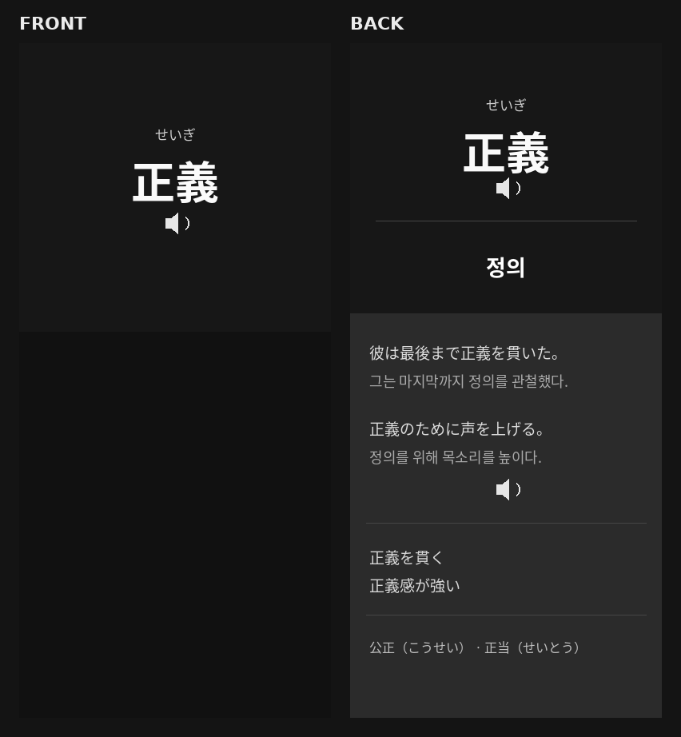

# Anki Vocabulary Helper

<p align="center">
  <strong>English</strong> ·
  <a href="./README.ja.md">日本語</a> ·
  <a href="./README.ko.md">한국어</a>
</p>

<p align="center">
  <a href="https://signife.github.io/anki-helper/">
    
  </a>
</p>

<p align="center">
  
</p>

<p align="center">
  A static web tool that sends Japanese vocabulary cards to Anki, displays ruby furigana, and generates word and example audio with AivisSpeech.
</p>

<p align="center">
  
  
  
  <a href="https://ankiweb.net/shared/info/2055492159">
    
  </a>
  <a href="https://github.com/Aivis-Project/AivisSpeech">
    
  </a>
</p>


## Features

- Add ChatGPT-generated card JSON directly to Anki through AnkiConnect
- Process one card or multiple cards at once
- Import JSON arrays, multiple JSON objects, and JSON/TXT files
- Generate word and example audio with the local AivisSpeech API
- Display ruby furigana in common expressions and example sentences
- Toggle furigana on and off on the back of the card
- Store audio in Anki media with unique WAV filenames
- Support Japanese → Japanese and Japanese → native-language card modes
- English, Japanese, Korean, and Chinese web UI
- Automatically create and update the Anki note type, fields, templates, and CSS
- Show a kanji information popup when a kanji is clicked on the back
- Reveal reading and hidden kanji information by holding the front
- Responsive card layout for desktop and mobile

## Requirements

The web page itself does not need to be installed. Open the deployed GitHub Pages site in a browser.

Required local applications:

1. **[Anki Desktop](https://apps.ankiweb.net/)**
2. **[AnkiConnect add-on](https://ankiweb.net/shared/info/2055492159)**
   - Add-on code: `2055492159`
3. **[AivisSpeech](https://github.com/Aivis-Project/AivisSpeech)**
4. A recent version of Chrome or Edge

No backend server, Node.js, npm, or Python installation is required for normal use.

## Project Structure

```text
anki-helper-modular/
├─ index.html
├─ README.md
├─ README.ja.md
├─ README.ko.md
├─ css/
│  └─ style.css
├─ js/
│  ├─ app.js
│  ├─ config.js
│  ├─ samples.js
│  ├─ templates.js
│  └─ translations.js
├─ docs/
│  └─ images/
│     └─ anki-card-preview.png
```

## User Setup

### 1. Install Anki

Install and start Anki Desktop.

### 2. Install AnkiConnect

In Anki:

```text
Tools
→ Add-ons
→ Get Add-ons
→ Code: 2055492159
```

Restart Anki after installation.

### 3. Configure AnkiConnect CORS

Open:

```text
Tools
→ Add-ons
→ AnkiConnect
→ Config
```

Add your GitHub Pages origin to `webCorsOriginList`.

```json
{
  "webCorsOriginList": [
    "https://signife.github.io"
  ]
}
```

For local development, you may also allow:

```json
{
  "webCorsOriginList": [
    "http://localhost",
    "http://127.0.0.1",
    "https://signife.github.io"
  ]
}
```

Save the configuration and restart Anki.

### 4. Install and Start AivisSpeech

Install and start AivisSpeech.

Default local API URL:

```text
http://127.0.0.1:10101
```

API documentation:

```text
http://127.0.0.1:10101/setting
```

When browser access is blocked, allow the following origin in AivisSpeech:

```text
https://signife.github.io
```

Restart AivisSpeech after changing its settings.

## Connection Check

1. Start Anki.
2. Start AivisSpeech.
3. Open the deployed web page.
4. Confirm these values:

```text
AnkiConnect URL
http://localhost:8765
```

```text
Speech engine URL
http://127.0.0.1:10101
```

5. Click **Test connection**.
6. A green check means both services are ready.

## Initial Anki Setup

Choose:

- Deck name
- Card mode
- Card font
- AivisSpeech voice
- Speech speed
- Whether to generate word audio
- Whether to generate example audio

Then click **Create recommended Anki setup**.

If the note type already exists, the app updates:

- Front template
- Back template
- Card CSS
- Missing fields

## Anki Note Type

Default note type:

```text
signife_anki_helper
```

It uses 13 fields:

| Field | Description |
|---|---|
| `CardMode` | `jp-jp` or `jp-native` |
| `Word` | Japanese headword |
| `Reading` | Full hiragana reading |
| `Definition` | Japanese definition |
| `NativeMeaning` | Meaning in the user's language |
| `Expressions` | Common expressions, with optional HTML ruby furigana |
| `Examples` | Example sentences, with optional HTML ruby furigana |
| `Synonyms` | Synonyms |
| `KanjiData` | Per-kanji information as JSON |
| `WordAudio` | Word audio tag |
| `ExamplesAudio` | Example audio tags |
| `WordAudioSource` | Word audio generation metadata |
| `ExamplesAudioSource` | Example audio generation metadata |

## Card Modes

### `jp-jp`

Shows the Japanese definition on the back.

```json
{
  "cardMode": "jp-jp"
}
```

### `jp-native`

Shows the native-language meaning on the back.

```json
{
  "cardMode": "jp-native"
}
```

## Card JSON Example

Expressions and examples may contain safe HTML ruby tags. Do not use Markdown inside JSON string values.

```json
{
  "cardMode": "jp-native",
  "word": "正義",
  "reading": "せいぎ",
  "definition": "正しい道理。また、社会を公平に保つための正しい考え方。",
  "nativeMeaning": "justice; righteousness",
  "expressions": [
    "<ruby><rb>正義</rb><rt>せいぎ</rt></ruby>を<ruby><rb>貫</rb><rt>つらぬ</rt></ruby>",
    "<ruby><rb>正義</rb><rt>せいぎ</rt></ruby>を<ruby><rb>守</rb><rt>まも</rt></ruby>る",
    "<ruby><rb>正義</rb><rt>せいぎ</rt></ruby>に<ruby><rb>反</rb><rt>はん</rt></ruby>する",
    "<ruby><rb>正義</rb><rt>せいぎ</rt></ruby>の<ruby><rb>味方</rb><rt>みかた</rt></ruby>"
  ],
  "examples": [
    "<ruby><rb>彼</rb><rt>かれ</rt></ruby>は<ruby><rb>最後</rb><rt>さいご</rt></ruby>まで<ruby><rb>自分</rb><rt>じぶん</rt></ruby>の<ruby><rb>正義</rb><rt>せいぎ</rt></ruby>を<ruby><rb>貫</rb><rt>つらぬ</rt></ruby>いた。",
    "それは<ruby><rb>正義</rb><rt>せいぎ</rt></ruby>に<ruby><rb>反</rb><rt>はん</rt></ruby>する<ruby><rb>行為</rb><rt>こうい</rt></ruby>だ。"
  ],
  "exampleReadings": [
    "かれはさいごまでじぶんのせいぎをつらぬいた。",
    "それはせいぎにはんするこういだ。"
  ],
  "synonyms": [
    "公正",
    "正当",
    "道義"
  ],
  "kanji": {
    "正": "On: セイ・ショウ / Kun: ただしい・ただす",
    "義": "On: ギ / Meaning: moral duty or what is right"
  }
}
```

## GPT Prompt Example

The copy prompt is written in English so it behaves consistently across the English, Japanese, Korean, and Chinese UI.

```text
Create one valid JSON object for the signife_anki_helper Anki note type from the following Japanese word or grammar expression.

Output JSON only.
Do not include explanations, markdown, or code fences.

Required fields:
cardMode, word, reading, definition, nativeMeaning, expressions, examples, exampleReadings, synonyms, kanji.

Rules:
1. cardMode must be "jp-native".
2. word must contain the target Japanese word or grammar expression.
3. reading must contain the full hiragana reading of the target word or expression.
4. definition must be a natural Japanese dictionary-style definition.
5. nativeMeaning must be a natural meaning in the user's native language.
6. expressions must contain 3 to 5 common collocations or fixed expressions.
7. examples must contain 2 natural Japanese example sentences.
8. exampleReadings must contain the full hiragana readings of examples, in the same order.
9. synonyms must contain 2 to 4 synonyms or similar expressions.
10. kanji must be an object. For each kanji in the target word, include its onyomi, kunyomi, and meaning.
11. If there is no information for a field, use [] or {}, not null.
12. The JSON must be valid. Do not add trailing commas.

Ruby rules for expressions and examples:
- In expressions and examples, add furigana to kanji by using HTML ruby tags.
- Use this exact format:
  <ruby><rb>漢字</rb><rt>かんじ</rt></ruby>
- Do not add ruby tags to hiragana, katakana, particles, or punctuation.
- Do not use Markdown.
- Do not use bullet syntax inside JSON string values.
- Keep the sentence natural and readable.

Example of ruby format:
<ruby><rb>彼</rb><rt>かれ</rt></ruby>は<ruby><rb>最後</rb><rt>さいご</rt></ruby>まで<ruby><rb>自分</rb><rt>じぶん</rt></ruby>の<ruby><rb>正義</rb><rt>せいぎ</rt></ruby>を<ruby><rb>貫</rb><rt>つらぬ</rt></ruby>いた。

Output format:
{
  "cardMode": "jp-native",
  "word": "",
  "reading": "",
  "definition": "",
  "nativeMeaning": "",
  "expressions": [],
  "examples": [],
  "exampleReadings": [],
  "synonyms": [],
  "kanji": {}
}
```

## Audio Generation Flow

```text
JSON input
→ choose reading or voiceText
→ AivisSpeech /audio_query
→ apply speedScale
→ AivisSpeech /synthesis
→ create WAV Blob
→ generate unique filename
→ AnkiConnect storeMediaFile
→ save [sound:filename.wav] in the field
```

Example filenames:

```text
signife_word_1781741234567_a8d42f6b911c.wav
signife_example_1_1781741238912_f1920ed34b7a.wav
```

The card template does not guess filenames. It only renders:

```html
{{WordAudio}}
{{ExamplesAudio}}
```

## Card Design

### Front

- Headword
- Reading revealed by holding the card
- Word audio button
- Matching font and word size on front and back

### Back

- Headword and reading
- Clickable per-kanji popup
- Word audio
- Japanese definition or native meaning
- Furigana toggle for expressions and examples
- Scrollable gray detail area
  - Examples with optional ruby furigana
  - Example audio
  - Common expressions with optional ruby furigana
  - Synonyms

The card font is selected in `config.js` and passed to `buildCardCss(fontStack)`. Font stacks use installed system fonts; bundled fonts are not required for normal desktop use.

## AivisSpeech Configuration

```js
export const SPEECH_ENGINE = {
  id: "aivis-speech",
  name: "AivisSpeech",
  defaultUrl: "http://127.0.0.1:10101",
  websiteUrl: "https://aivis-project.com/",
  settingsUrl: "http://127.0.0.1:10101/setting",
  sourceName: "AivisSpeech"
};
```

## Developer Setup

Normal users do not need this section.

```bash
git clone <YOUR_REPOSITORY_URL>
cd anki-helper-modular
python -m http.server 8000
```

Open:

```text
http://localhost:8000
```


## Troubleshooting

### AnkiConnect Connection Failed

Check:

- Anki is running
- AnkiConnect is installed
- The URL is `http://localhost:8765`
- Your site origin is included in `webCorsOriginList`
- Anki was restarted after the configuration change

### AivisSpeech Connection Failed

Check:

- AivisSpeech is running
- The URL is `http://127.0.0.1:10101`
- `http://127.0.0.1:10101/setting` opens
- The site origin is allowed
- AivisSpeech was restarted after the configuration change

### Card Design Did Not Update

1. Edit `js/templates.js` or `js/app.js`
2. Hard-refresh the browser
3. Click **Create recommended Anki setup** again
4. Check the note type templates and styling in Anki

### Ruby Furigana Does Not Appear

Check:

- `expressions` and `examples` contain HTML ruby tags, not Markdown
- The app stores `Expressions` and `Examples` with the ruby-aware list renderer
- The back template includes the furigana toggle script
- You clicked **Create recommended Anki setup** again after changing templates or CSS


## Privacy

- Card JSON is not stored on this website.
- Card data is sent only to AnkiConnect on the user's computer.
- Audio synthesis is processed locally by AivisSpeech.
- Generated audio is stored in the Anki media collection.

## License

Add the repository license that matches your project, for example:

```text
MIT License
```
